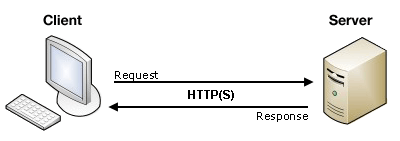

# 🙋🏻 HTML Form Handling

Form handlers are crucial for processing the data submitted by users in web forms. This guide provides an overview of client-side and server-side form handling, highlighting best practices for capturing and processing user input.



## 🖥 Client-side Form Handling
Client-side form handling is often managed using JavaScript to validate data before sending it to the server.

### Example: Capturing Form Data with JavaScript
```html title="form-handler-example.html"
<form id="userForm">
  <label for="username">Username:</label>
  <input type="text" id="username" name="username" required>
  <button type="submit">Submit</button>
</form>

<script>
  document.getElementById('userForm').addEventListener('submit', function(event) {
    event.preventDefault(); // Prevents form from submitting normally
    const formData = new FormData(event.target);
    const username = formData.get('username');
    console.log('Submitted Username:', username);
  });
</script>
```

### Benefits of Client-side Handling:
- Reduces server load by validating and handling data locally.
- Provides immediate feedback to users.

## 🌐 Server-side Form Handling
Server-side form handling involves processing form submissions on a server using languages such as Node.js, PHP, Python, or others.

### Example: Simple Node.js Form Handler
```javascript title="server.js"
const express = require('express');
const app = express();
app.use(express.urlencoded({ extended: true }));

app.post('/submit-form', (req, res) => {
  const { username } = req.body;
  console.log('Received Username:', username);
  res.send(`Form received with username: ${username}`);
});

app.listen(3000, () => {
  console.log('Server is running on http://localhost:3000');
});
```

### Benefits of Server-side Handling:
- Ensures data security and integrity.
- Processes and stores user input for long-term use.

## 🔒 Best Practices for Secure Form Handling
1. **Sanitize and Validate User Input**: Always clean and validate input data on the server to prevent SQL injection, XSS, and other vulnerabilities.
2. **Use HTTPS**: Ensure your site uses HTTPS to encrypt data transmitted between the client and server.
3. **Limit Data Exposure**: Avoid sending sensitive data in query parameters.

## 🔗 Further Reading
- [MDN Web Docs: Sending Form Data](https://developer.mozilla.org/en-US/docs/Learn/Forms/Sending_and_retrieving_form_data)
- [Express.js Guide: Handling Form Inputs](https://expressjs.com/en/guide/routing.html#form-handling)

Understanding form handlers and applying best practices ensures robust and secure user data processing.

## 📝 Summary

Client-side and server-side form handling are essential for processing user input securely. By combining client-side validation with server-side processing, web developers can create reliable and secure web forms.